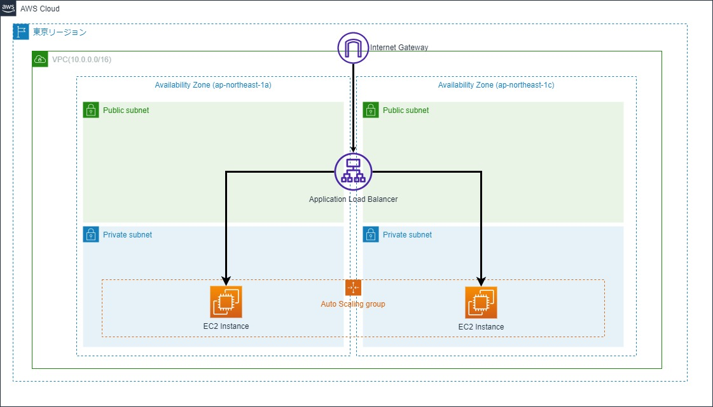

# ALB + AutoScallingのWebサーバ(Nginx)を構築する。

## 想定利用者
- 性能・拡張性を考慮したWebサーバを構築したい方
- EC2インスタンスの運用を考慮したAWS環境を構築したい方

## 実現したいこと
1. ローカル端末からパブリックサブネット上に配置したALBに対してHTTPリクエストを行い、ALBからプライベートサブネット上のNginx(EC2インスタンス)へHTTP接続を行う。
2. ローカル端末からSession Managerを利用してプライベートサブネット上のEC2インスタンス上にSSH接続を行う。利用するAWS CLIコマンドは以下の通り。
    ``` 
    aws ssm start-session --target [インスタンスID] 
    ```


## システム構成図
構築するシステム構成は以下の通り<br>


## 事前準備
1. ローカル端末にTerraformをインストール
2. ローカル端末にAWS CLIをインストール
3. ローカル端末に[Session Managerプラグイン](https://docs.aws.amazon.com/systems-manager/latest/userguide/session-manager-troubleshooting.html#plugin-not-found
)をインストール
4. 以下の権限を有するIAMポリシーに紐づいたIAMユーザーを用意し、ローカル端末でAWS CLIでIAMクレデンシャル情報を設定する。
   1. AmazonEC2FullAccess
   2. IAMFullAccess
   3. AmazonSSMFullAccess
5. SSH設定ファイルを更新
   1. 更新手順については、[AWS公式ページ](https://docs.aws.amazon.com/ja_jp/systems-manager/latest/userguide/session-manager-getting-started-enable-ssh-connections.html)を参考

## 使用方法
1. main.tfファイル直下に移動し、以下のコマンドを実行する
    ```
    terraform init
    terraform plan
    terraform apply
    ```
2. ALBのDNS名を確認し、ブラウザで開く　※前提としてPowershellでの実行を想定
    ```
    terraform show | Select-String -Pattern "dns_name.*elb.*" 
    ```

3. 利用を終了したい場合、以下のコマンドで削除する
    ```
    terraform destroy
    ```

## ライセンス
MIT.
